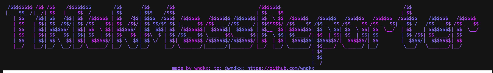

# TikTokMassReporter



## 🔥 Features

- Fully Requests Based
- Not detectable by TikTok algorithms
- Auto Proxy Support(optional)
- Supports all report types
- Slick UI
- Easy & Fast To Setup
- Works by using asynchronous methods
- Super fast

## How to get a report url

   [Get ReportURL](https://github.com/wndkx/TikTokMassReporter/raw/refs/heads/main/assets/getreporturl.mp4)

## ✍️ Usage

1. Download or clone this repo
2. `cd` into the repo
3. Install all dependencies: ```pip3 install -r requirements.txt```
4. Edit `reporturl.txt` file to set your own report url
5. Edit `config.py` by setting those settings up

- `USE_PROXIES` True or False, depends if you want to use them or not
- `PROXY_TYPE` You can select which proxy type(http, https, socks4, socks5(beta)) to use in this scenario

6. Launch `main.py` by using: ```python3 main.py```
7. Set the amount of requests
8. Select the amount of threads
9. Enjoy:)!

## ⚠️ DISCLAIMER / NOTES

This github repo is for EDUCATIONAL PURPOSES ONLY. I am NOT under any responsibility if a problem occurs.

## ✨ Issues / Doubts / Questions

- If you have any questions do not hesitate to ask me: [telegram](https://t.me/wndkx_support_bot)
- Or if you have any error do not forget to report it in: [issues](https://github.com/wndkx/TiktokMassReporter/issues/new)
